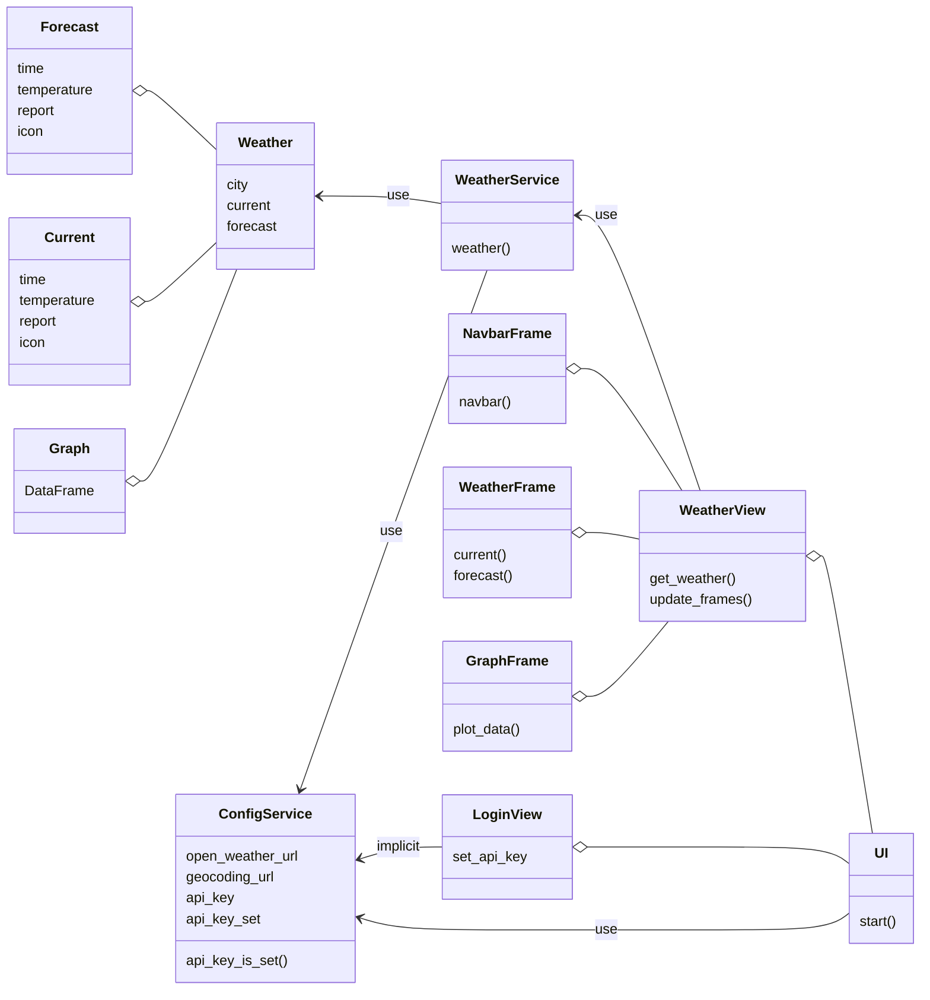
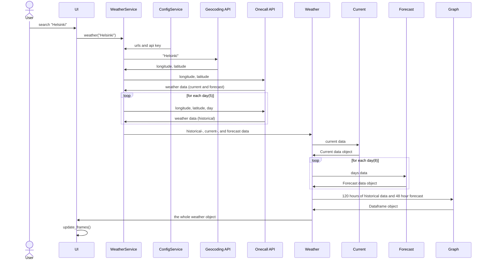

# Class Diagram
---

```mermaid
    classDiagram
        
        direction RL

        class UI {
            start()
        }

        class LoginView {
            set_api_key
        }

        class WeatherView {
            get_weather()
            update_frames()
        }

        class NavbarFrame {
            navbar()
        }

        class WeatherFrame {
            current()
            forecast()
        }

        class GraphFrame {
            plot_data()
        }
        
        class WeatherService {
            weather()
        }

        class ConfigService {
            open_weather_url
            geocoding_url
            api_key
            api_key_set
            api_key_is_set()
        }

        class Weather {
            city
            current
            forecast
        }
        
        class Current {
            time
            temperature
            report
            icon
        }

        class Forecast {
            time
            temperature
            report
            icon
        }

        class Graph {
            DataFrame
        }

        Weather --o Forecast
        Weather --o Current
        Weather --o Graph
        WeatherService --> Weather: use
        WeatherService --> ConfigService: use
        UI --o WeatherView
        UI --o LoginView
        UI --> ConfigService: use
        WeatherView --> WeatherService: use
        WeatherView --o NavbarFrame
        WeatherView --o WeatherFrame
        WeatherView --o GraphFrame
        LoginView --> ConfigService: implicit
        
```

---

# Sequence Diagram

```mermaid
    sequenceDiagram

    actor User
    participant UI
    participant WeatherService
    participant ConfigService
    participant Geocoding API
    participant Onecall API
    participant Weather
    participant Current
    participant Forecast
    participant Graph

    User ->> UI: search "Helsinki"
    UI ->> WeatherService: weather("Helsinki")
    ConfigService ->> WeatherService: urls and api key
    WeatherService ->> Geocoding API: "Helsinki"
    Geocoding API ->> WeatherService: longitude, latitude
    WeatherService ->> Onecall API: longitude, latitude
    Onecall API ->> WeatherService: weather data (current and forecast)

    loop for each day(5)
    WeatherService ->> Onecall API: longitude, latitude, day
    Onecall API ->> WeatherService: weather data (historical)
    end

    WeatherService ->> Weather: historical-, current-, and forecast data
    Weather ->> Current: current data
    Current ->> Weather: Current data object

    loop for each day(8)
    Weather ->> Forecast: days data
    Forecast ->> Weather: Forecast data object
    end

    Weather ->> Graph: 120 hours of historical data and 48 hour forecast
    Graph ->> Weather: Dataframe object
    Weather ->> UI: the whole weather object
    UI ->> UI: update_frames()

```