# Architecture Description

---

## Table of contents
- [Basic Structure](#basic-structure)
- [User Interface](#user-interface)
- [Services](#services)
    - [ConfigService](#configservice)
    - [WeatherService](#weatherservice)
    - [IconService](#iconservice)
- [Entities](#entities)
    - [Weather](#weather)
    - [Current](#current)
    - [Forecast](#forecast)
    - [Graph](#graph)
- [Structure as a Whole](#structure-as-a-whole)
- [Main Functionality](#main-functionality)
    - [Setting the API Key](#setting-the-api-key)
    - [Searching for Location](#searching-for-location)
- [A Short Discussion on Entity Structure](#a-short-discussion-on-entity-structure)

---

## Basic Structure  

The app's general structure follows a three-layered model.

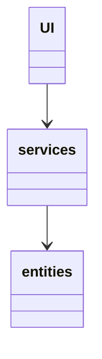
The UI component includes everything related to user interface elements. This part only displays data retrieved from service elements. The service elements implement the App logic, or in the case of this app, the interaction with the API. The task of entities is to model this API data to something more usable from the app's perspective. Eventually, these instances of entities return to the UI, where they are unpacked and displayed to the user.

[Back to Top](#architecture-description)

---

## User Interface

The user interface consists of views and frames. Views, managed by the UI element, are usually built from a collection of Frames.
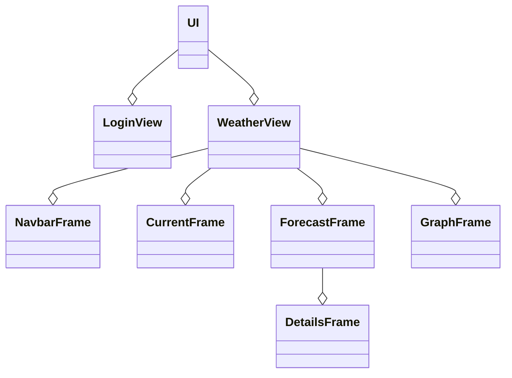

In total, the app includes two views; Login- and WeatherView. LoginView is currently used to set the user's API key on the first execution. At the same time, the WeatherView operates as the app's main view. Compared to LoginView, where the view handles all the operations, the Weatherview works more as a manager. It only controls the refreshing of frames and the calls on service methods, leaving the task of displaying graphical elements to Frames.

[Back to Top](#architecture-description)

---

## Services

---

### ConfigService

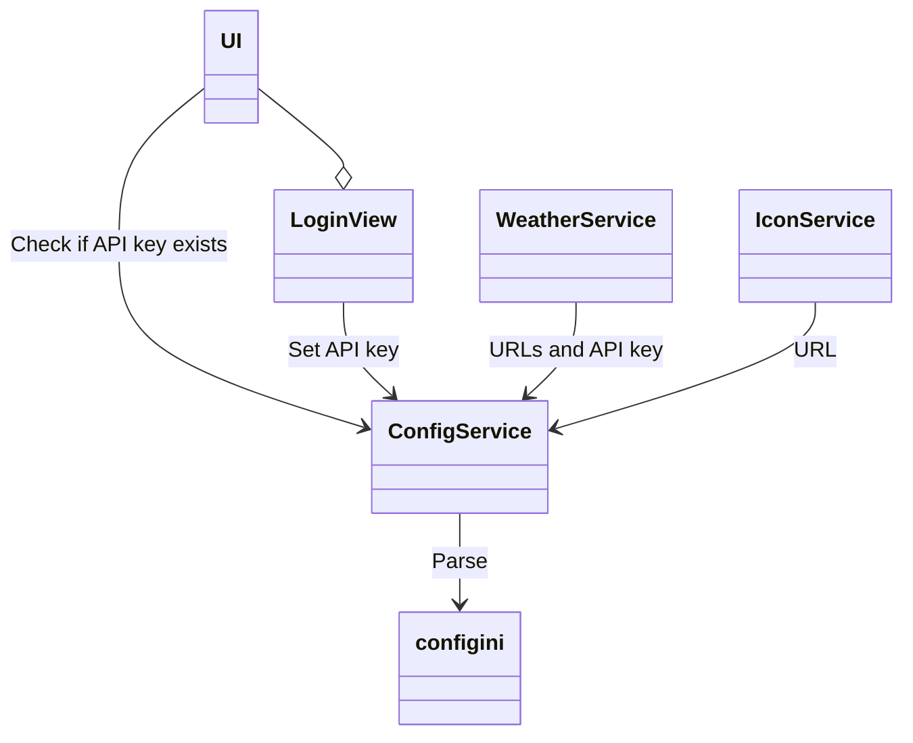

The config service is the most global of these three, providing URLs and the API key across the application. It mainly operates with a config.ini file where all necessary information is stored and read on demand. The configuration file system provides excellent flexibility with the service since it's not instance dependent.

[Back to Top](#architecture-description)

---

### WeatherService

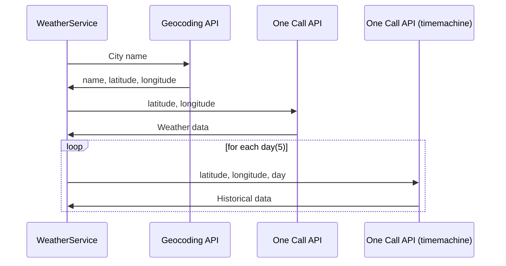

The weather service is the one that interacts with the OpenWeather API. In total, the app makes seven calls to three different API endpoints. The first call to Geocoding API converts the city name from user input to latitude and longitude. Using these coordinates, the second call to OpenWeathers One call API endpoint returns the current weather and the forecast for the upcoming days. Finally, the One Call APIs time machine requires five separate calls for each day to get hourly historical data for the past five days. The service passes the data on to the Weather entity and returns it.

[Back to Top](#architecture-description)

---

### IconService

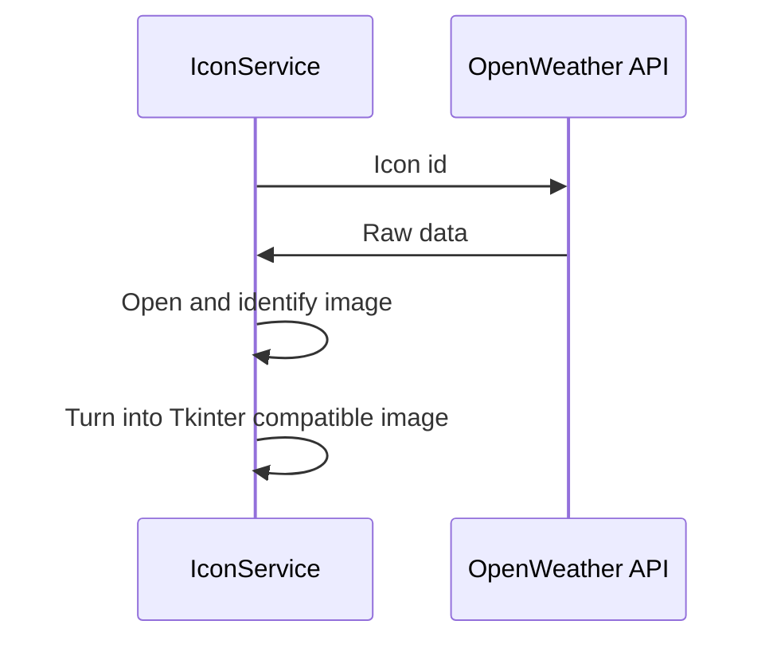

The icon service retrieves weather icons from OpenWeather API. The class's only method uses the icon id (passed as an argument) to get icon data. Using Pillow module, the raw data is converted to ImageTk PhotoImage object and returned.

[Back to Top](#architecture-description)

---

## Entities

---

*Entities describe data in a meaningful way.*

This app doesn't rely on stored data; instead, it retrieves the data on demand from the OpenWeather app. As is often the case, the raw data is formidable to manage and cluttered with unnecessary data(viewing from this app's point of view). The task of the four entities is to shape this data into a more expressive and easier to use state.

### Weather

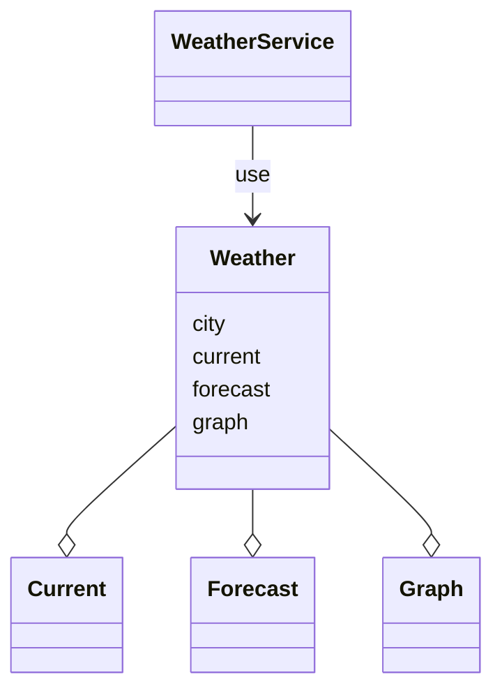

The primary entity is the Weather object. It combines the Current, Forecast, and Graph objects to create one unified entity. The only user of the Weather object is The WeatherService. When called, it receives the raw data as a parameter and uses it to initialize the other entities. The then-created final object returns to the original caller, WeatherView, where it's parsed and displayed accordingly.

[Back to Top](#architecture-description)

---

### Current

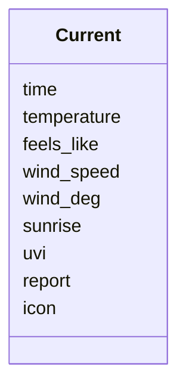

Contains the data for current weather.

[Back to Top](#architecture-description)

---

### Forecast

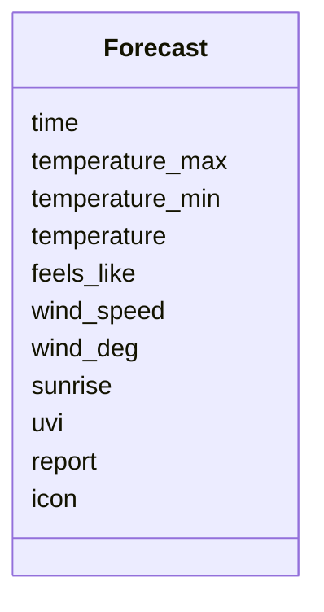

Contains a forecast day's data. The Weather entity initializes the forecast object for each day and stores them in a list.

[Back to Top](#architecture-description)

---

### Graph

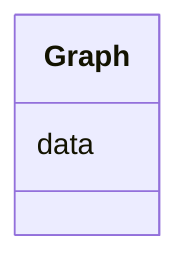

Forms and stores a DataFrame containing five-day hourly historical data and a two-day hourly forecast. The Graph frame plots the temperature and rain from the DataFrame.

[Back to Top](#architecture-description)

---

## Structure as a Whole

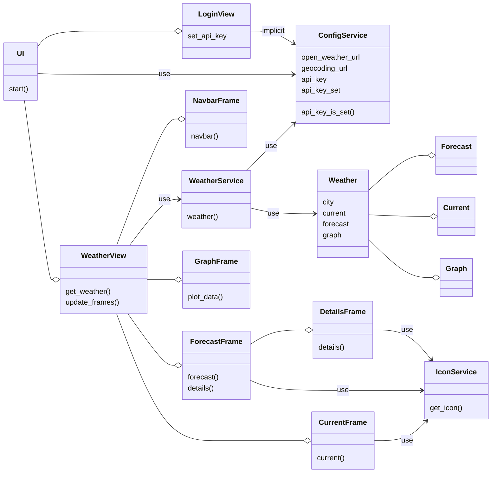

[Back to Top](#architecture-description)

---

## Main Functionality

---

### Setting the API Key

> *User starts the app*

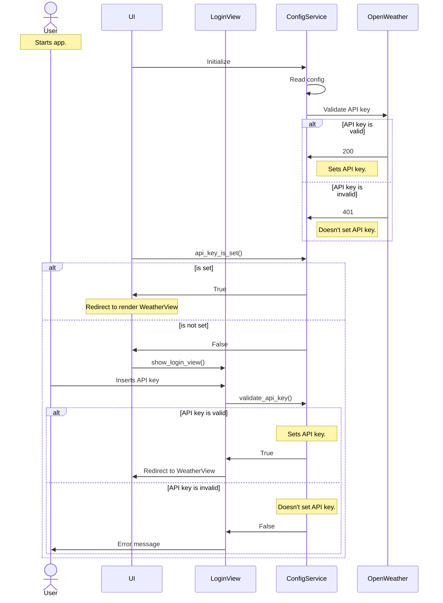

At the app start-up, the UI element initializes an instance of ConfigService. Apart from the API key, the service reads the config.ini file and sets the attributes. Before placing the API key, the service validates it by making a request to OpenWeather. If the API key is unset(does not exist or is just invalid), the UI opens the LoginView. The user can input their API key, and once validated, the LoginView redirects to WeatherView.

[Back to Top](#architecture-description)

---

### Searching for Location

> *User searches for "Helsinki"*

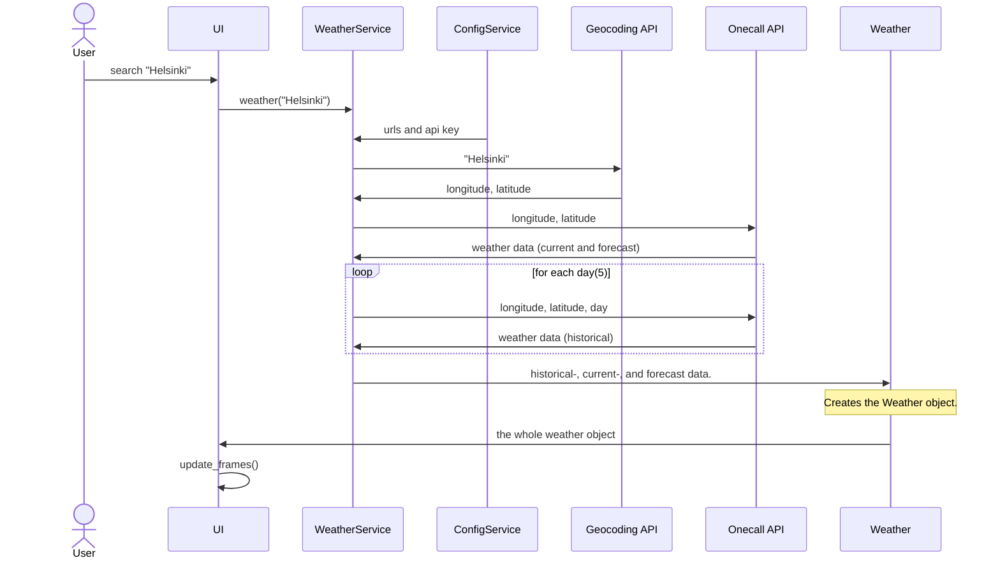

When the user searches for a location, it activates a call for WeatherService in the WeatherView component. The first order of business is to convert the input location name to latitude and longitude. Next, with the coordinates passed as an argument, the service retrieves the weather data from OpenWeather. Finally, the service passes the retrieved data to the Weather entity and returns it to UI.

[Back to Top](#architecture-description)

---

## A Short Discussion on Entity Structure

Overall the app is in great shape even though Current and Forecast entities share duplicate code. I could've implemented a base class to combat duplicate code, but I still chose not to. My reasoning lies in the very purpose of entities; entities describe the underlying data. Reflecting on that, I concluded that dispersing the data to combat duplicate code doesn't seem reasonable. The classes Current and Forecast are perfectly self-explanatory; both include the data for that concept. No need to piece together or hunt down shrapnels of data. Overall, it clarifies everything knowing that the Forecast entity describes all forecast data.

[Back to Top](#architecture-description)
