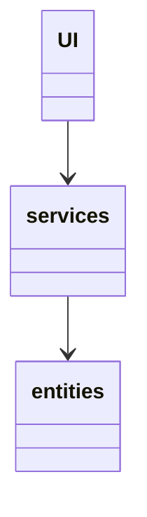
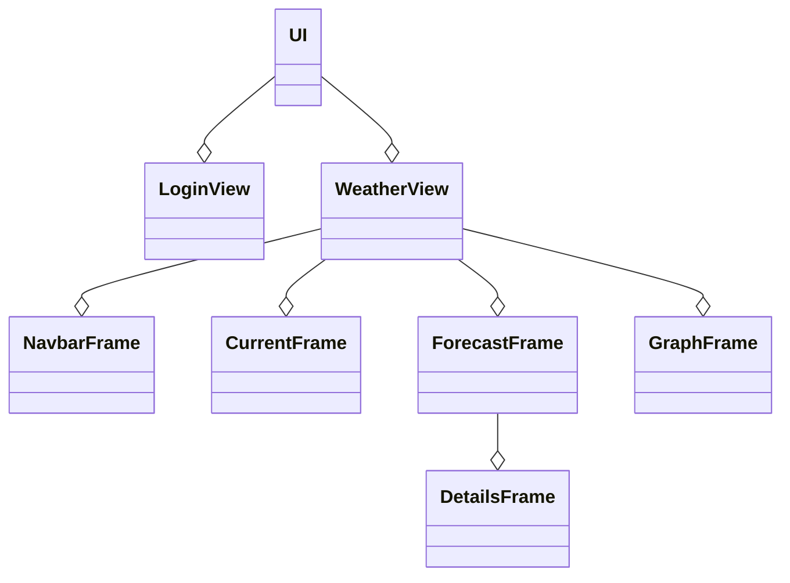
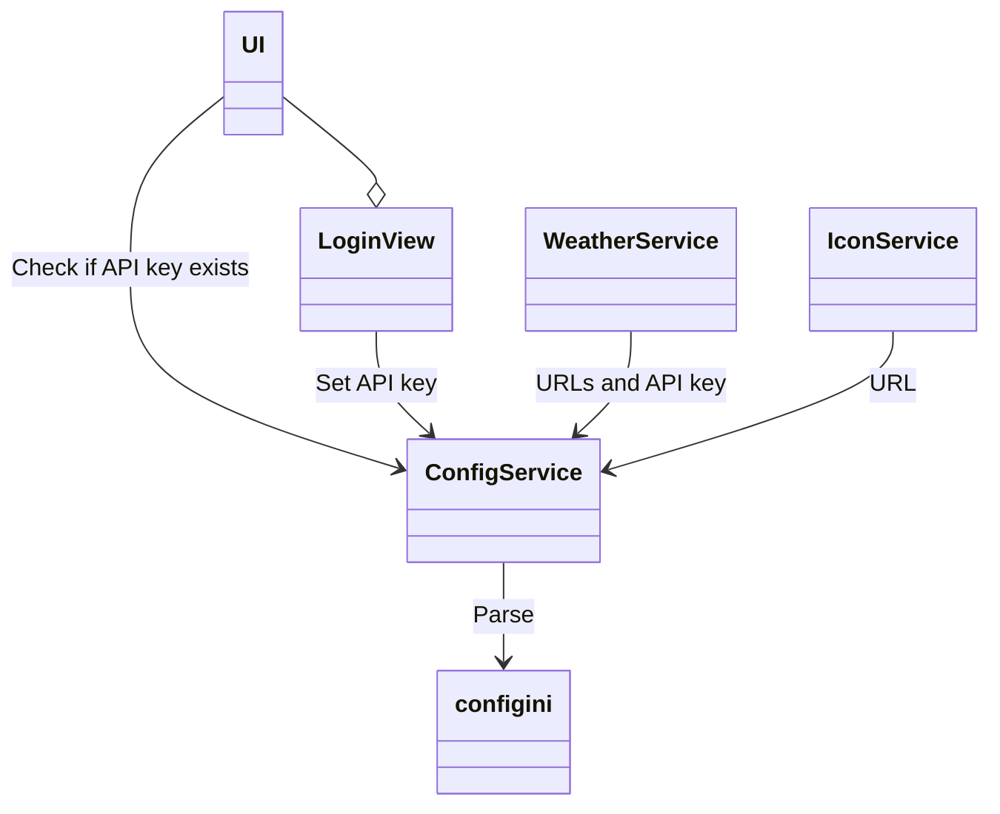
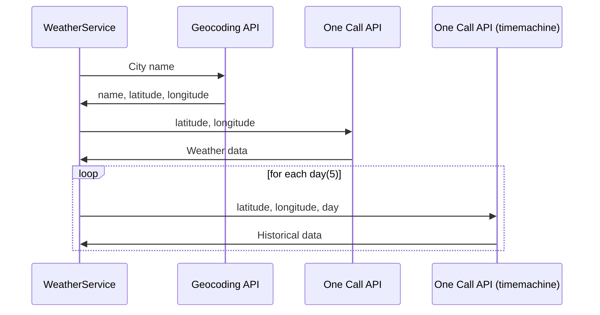
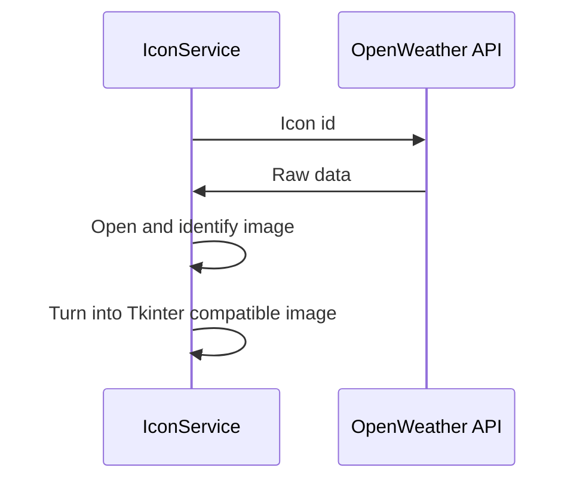
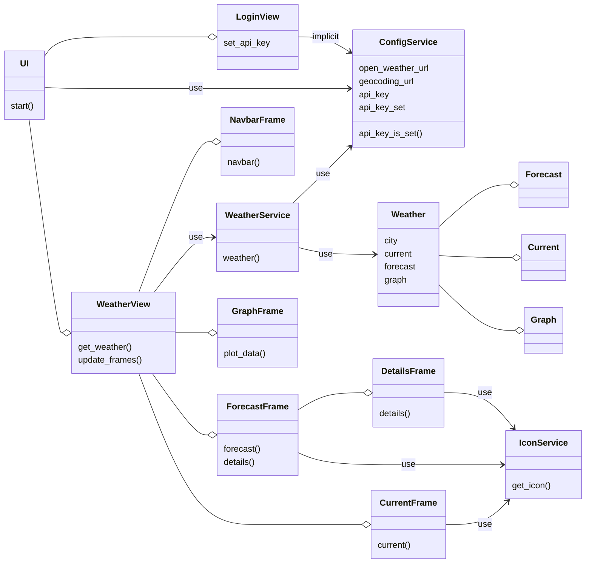
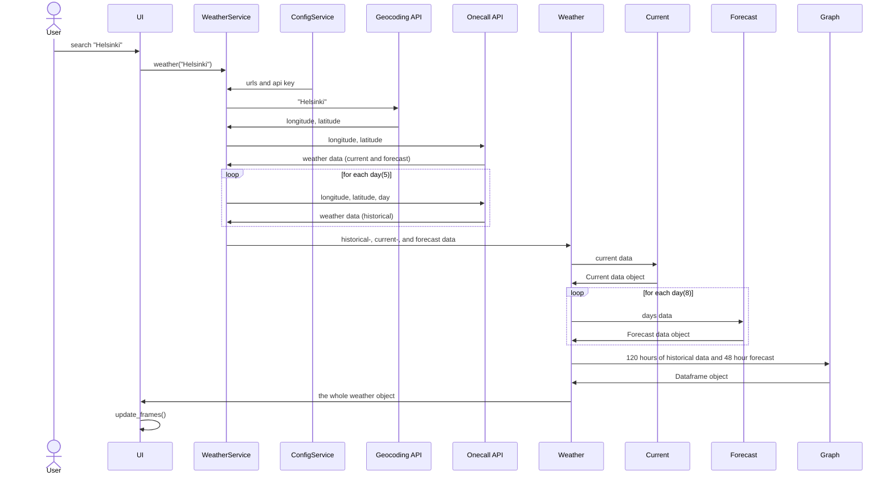

# Architecture Description
---
## Structure

The app's general structure follows a three-layered model.

The UI component includes everything related to user interface elements. This part only displays data retrieved from service elements. The service elements implement the App logic, or in the case of this app, the interaction with the API. The task of entities is to model this API data to something more usable from the app's perspective. Eventually, these instances of entities return to the UI, where they are unpacked and displayed to the user.

## User Interface

The user interface consists of views and frames. Views, managed by the UI element, are usually built from a collection of Frames.

In total, the app includes two views; Login- and WeatherView. LoginView is currently used to set the user's API key on the first execution. At the same time, the WeatherView operates as the app's main view. Compared to LoginView, where the view handles all the operations, the Weatherview works more as a manager. It only controls the refreshing of frames and the calls on service methods, leaving the task of displaying graphical elements to Frames.

## Services

---

#### ConfigService

The config service is the most global of these three, providing URLs and the API key across the application. It mainly operates with a config.ini file where all necessary information is stored and read on demand. The configuration file system provides excellent flexibility with the service since it's not instance dependent.

---

#### WeatherService

The weather service is the one that interacts with the OpenWeather API. In total, the app makes seven calls to three different API endpoints. The first call to Geocoding API converts the city name from user input to latitude and longitude. Using these coordinates, the second call to OpenWeathers One call API endpoint returns the current weather and the forecast for the upcoming days. Finally, the One Call APIs time machine requires five separate calls for each day to get hourly historical data for the past five days. The service passes the data to the Weather entity and returns it.

---

#### IconService

The icon service retrieves weather icons from OpenWeather API. The class's only method uses the icon id (passed as an argument) to get icon data. Using Pillow module, the raw data is converted to ImageTk PhotoImage object and returned.

---

## TODO...

#### Class Diagram

---

#### Sequence Diagram

