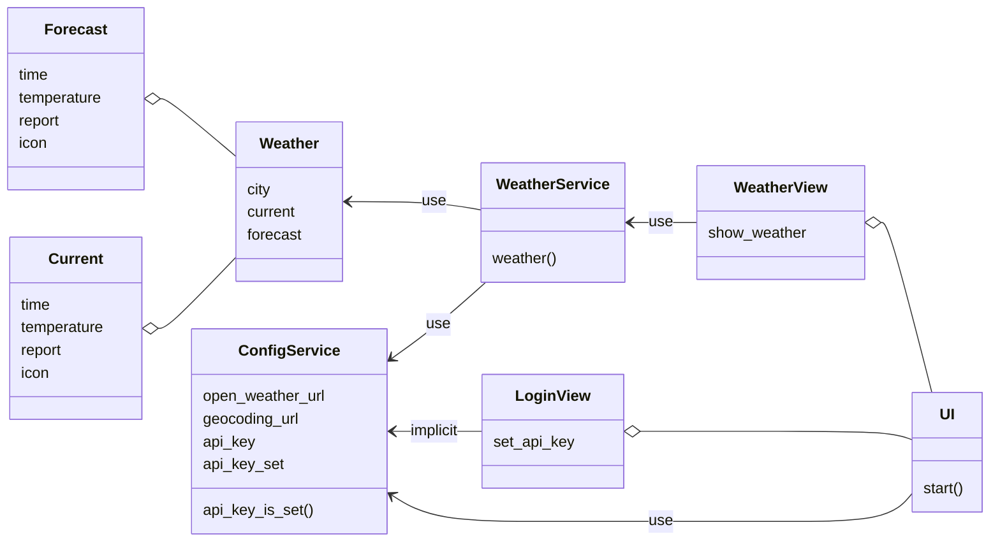

# Luokkakaavio
---

```mermaid
    classDiagram
        
        direction RL

        class UI {
            start()
        }

        class LoginView {
            set_api_key
        }

        class WeatherView {
            show_weather
        }
        
        class WeatherService {
            weather()
        }

        class ConfigService {
            open_weather_url
            geocoding_url
            api_key
            api_key_set
            api_key_is_set()
        }

        class Weather {
            city
            current
            forecast
        }
        
        class Current {
            time
            temperature
            report
            icon
        }

        class Forecast {
            time
            temperature
            report
            icon
        }

        Weather --o Forecast
        Weather --o Current
        WeatherService --> Weather: use
        WeatherService --> ConfigService: use
        UI --o WeatherView
        UI --o LoginView
        UI --> ConfigService: use
        WeatherView --> WeatherService: use
        LoginView --> ConfigService: implicit


        
```