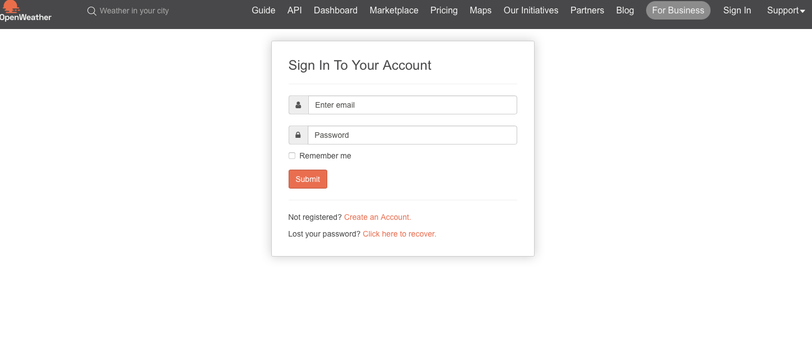
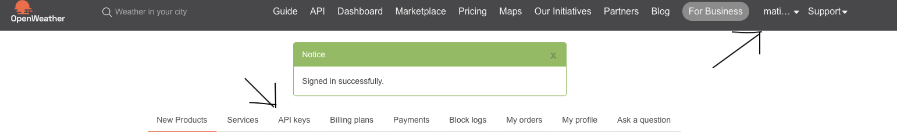
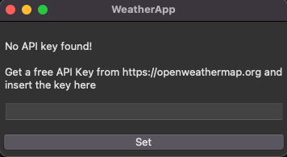
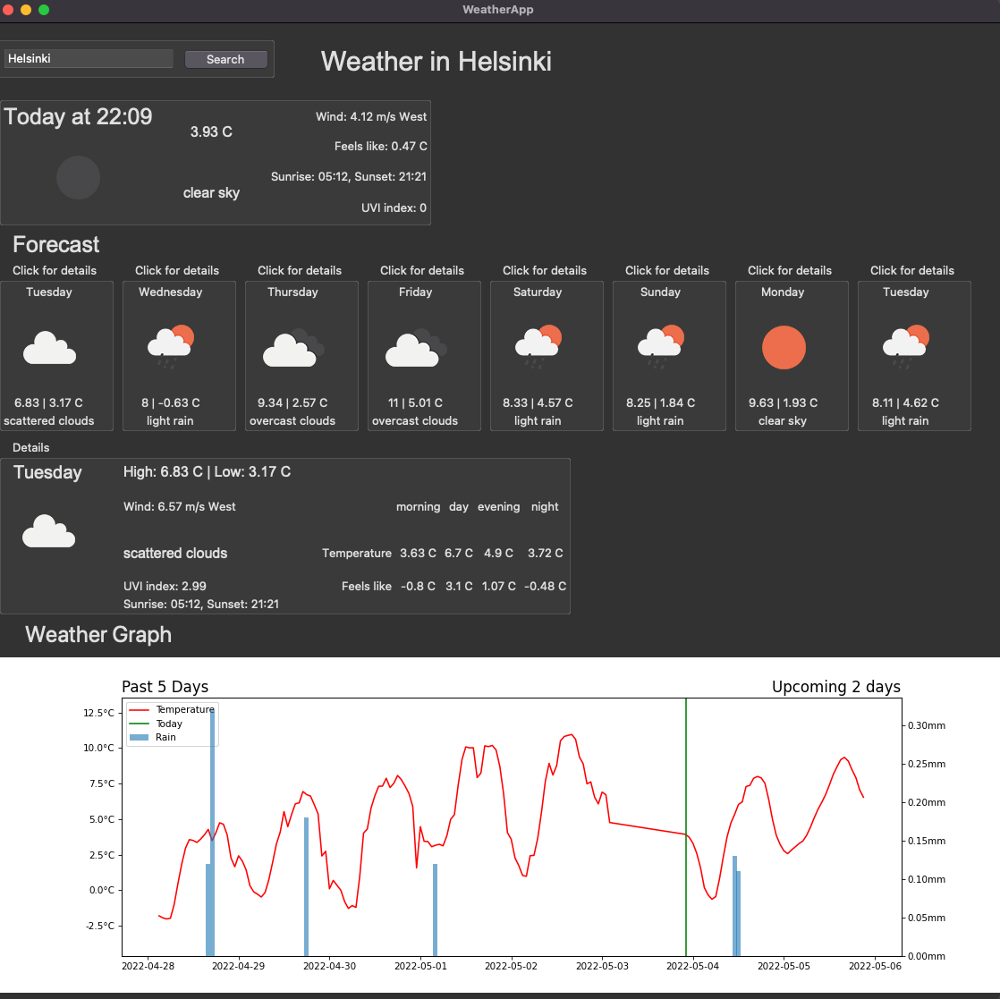

 # Instructions

 Download the latest [latest release](https://github.com/matiasto/ot-harjoitustyo/releases/tag/viikko6)

 ### Getting Started

1. Get a free API Key at [OpenWeather](https://home.openweathermap.org/users/sign_in)


---


Get free API key

3. Navigate to the project folder and install dependencies
    ```bash
    poetry install
    ````
> Please note that your Download folder may not have the permission to execute.

4. Start the application
    ```bash
    poetry run invoke start
    ````
5. During the first execution, the app will ask for API key accuired from step 1.
> Note: It takes few seconds to load after submission.



---

6. Success



# Use

1. On the top left you can search weather with location name. 
2. You can press the forecast days to open detailed view below it.

> *Enter* hasn't been implemented yet, so please press *Search*

> It may take few seconds to load.

> Error message for bad request shows in console.


