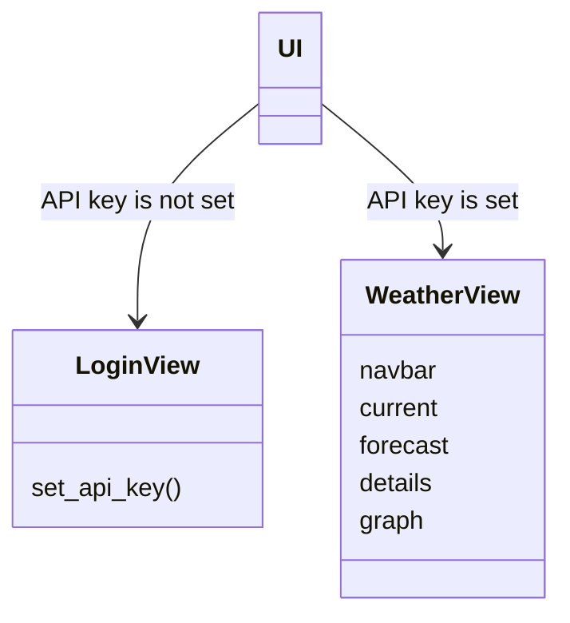

# Requirements Specification

---

## Purpose

WeatherApp is an [OpenWeather](https://openweathermap.org/api) API-powered desktop application that allows users to search for an area of interest and inspect its current-, forecast-, and historical weather data.

---

## User Groups

The app doesn't implement any user groups. The only requirement is a personal API key.

---

## Outline of the User Interface

The app consists of two views.

The app consists of two views. The [LoginView](../src/ui/views/login_view.py) is for setting up the API key, and the [WeatherView](../src/ui/views/weather_view.py) is for a valid API key.

---

## The Functionality Offered in the Early Version

- Using location name as a search term, the user can view:
    - [x] Detailed current weather.
    - [x] 8 day weather forecast.
    - [x] Detailed view of each forecast day.
    - [x] Rainfall temperature graph of upcoming two days and past five days.

---

## Development Ideas for Future Versions

- User can save favorite location.
    - Favorite location is shown first on app start up.
- More options for:
    - Forecast interval.
    - Historical data interval.