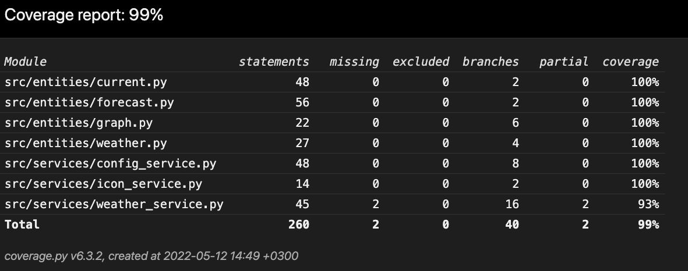

# Testing Document

---

## Services

The services form the app logic. As we know, the WeatherService and the IconService depend heavily on the OpenWeather API. For this reason, the tests employ actual calls to the OpenWeather API, and since the retrieved data varies from call to call, the tests mainly focus on data types rather than absolute values. In contrast, the tests on ConfigService can focus on absolute values rather than just data types. This difference in testing methodology derives from the fact that the ConfigService is not as reliant on the API; it primarily operates with the config file.

## Entities

The tests conducted on entities mainly check the correctness of parsing. After all, entities hold very little to no app logic in themselves. All the entity tests follow the same principle, inject mock response data and check the result.

## Test Coverage

Apart from the UI elements, the tests cover 99% of the app.

The only things excluded from the test coverage were in the WeatherService-weather method. A few of the error handling conditions placed in case weather data requests fail are impossible to test conveniently. That ought not to be a significant problem since the situation itself is extremely rare.

---

## System Tests

Manual tests were the sole method for system-level testing.

## Installation

The system-level tests included successful installations on macOS and Linux environments abided by the official instructions. Additionally, the tests involve inputting an invalid API key to the initial login screen.

## Functionalities

Manual tests incorporated every functionality mentioned in the requirements specification. Tested inputs included wrong inputs such as empty fields, random strings, and special characters.

