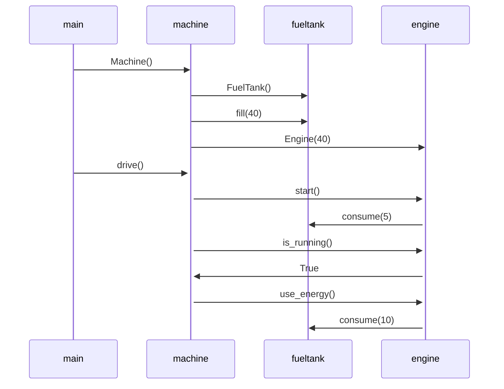

# Machine Sekvenssikaavio
---

```mermaid
    sequenceDiagram
        main->>machine: Machine()
        machine->>fueltank: FuelTank()
        machine->>fueltank: fill(40)
        machine->>engine: Engine(40)
        activate machine
        main->>machine: drive()
        activate engine
        machine->>engine: start()
        engine->>fueltank: consume(5)
        machine->>engine: is_running()
        engine->>machine: True
        machine->>engine: use_energy()
        engine->>fueltank: consume(10)
```