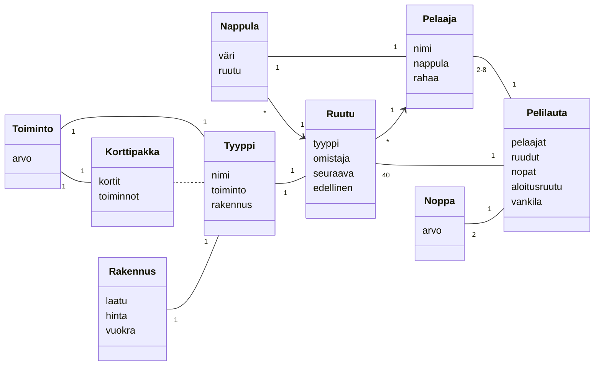

# Monopoli Tehtävä
---

```mermaid
    classDiagram
        
        direction RL
        
        class Pelilauta{
            pelaajat
            ruudut
            nopat
            aloitusruutu
            vankila
        }

        class Noppa{
            arvo
        }

        class Pelaaja{
            nimi
            nappula
            rahaa
        }

        class Nappula{
            väri
            ruutu
        }

        class Ruutu{
            tyyppi
            omistaja
            seuraava
            edellinen
        }

        class Tyyppi {
            nimi
            toiminto
            rakennus
        }

        class Rakennus{
            laatu
            hinta
            vuokra
        }

        class Korttipakka {
            kortit
            toiminnot
        }

        class Toiminto {
            arvo
        }

        Pelilauta "1" -- "2-8" Pelaaja
        Pelilauta "1" -- "40" Ruutu
        Pelilauta "1" -- "2" Noppa
        Pelaaja "1" -- "1" Nappula
        Pelaaja "1" <-- "*" Ruutu
        Ruutu "1" <-- "*" Nappula
        Ruutu "1" -- "1" Tyyppi
        Tyyppi "1" -- "1" Toiminto
        Tyyppi .. Korttipakka
        Tyyppi "1" -- "1" Rakennus
        Korttipakka "1" -- "1" Toiminto
```